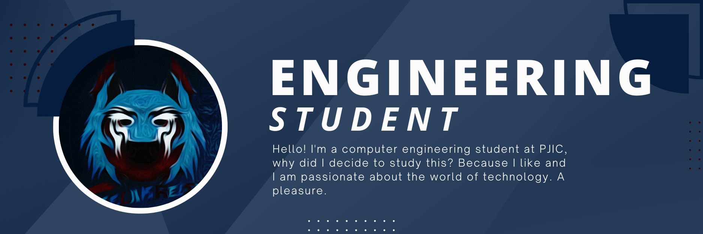

<h1 align="center">Hello, I'm <a href="https://github.com/Teelakreiste">Teelakreiste</a> 🦥</h1>

# 💫 About Me:
- 📚 I'm currently focused on my Computer Engineering education, seeking to expand my knowledge and skills. 
- 🎮 In addition to my academic life, I am a video game enthusiast. 
- 🎵 Music is another passion of mine, and I love discovering new genres and artists. 
- 💻 I always try to be aware of the latest technology trends and am excited to learn new technologies and programming languages.  
¡I hope you enjoy exploring my profile on GitHub! 😊 

# 💻 Tech Stack:
           
# 📊 GitHub Stats:

 
 
 
 

### ✍️ Random Dev Quote

 

### 😂 Random Dev Meme

